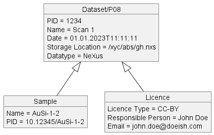
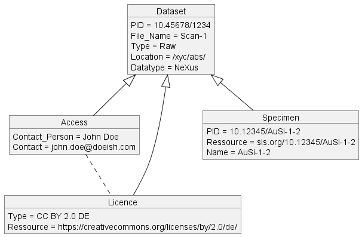
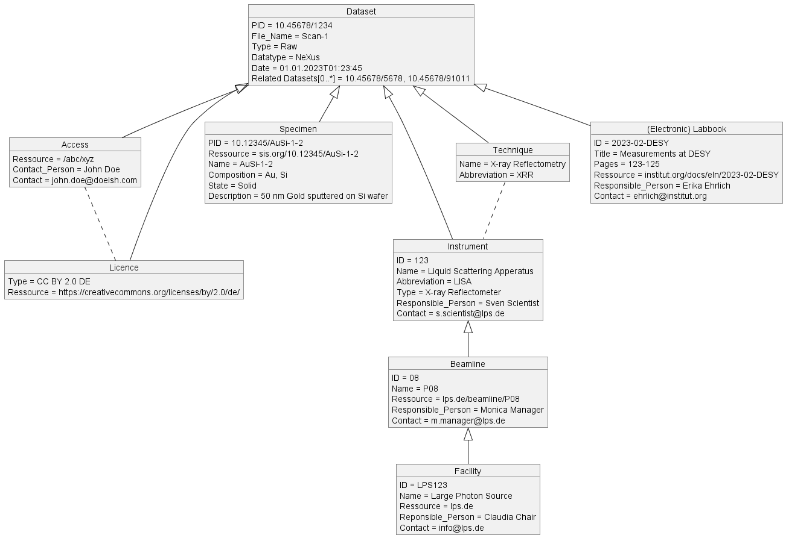

# UML Metadata Schema for DAPHNE
Created by plantUML

---
## Different metadata schema for PaN Community with different level of detail
#### Minimal Schema

#### MinimalPLUS Schema

#### Richer Schema

---
### Contribute
Please feel free to contribute to this schemas by pull reqeuests or issues. Would be highly appreciated. 

---
Part of TaskArea 1 in DAPHNE4NFDI (DAten aus PHotonen und Neutronen Experimenten). (https://www.daphne4nfdi.de/)
