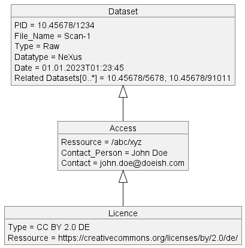

# Schema4Daphne
**Motivation:**
Draft a Metadata Schema for Photon and Neutron Experiments. UML is used to visualize the structure and connections of the schema. Multiple schemes are presented thereafter. 

Github Repo: [https://github.com/PhilippJo/Metadataschema4DAPHNE](https://github.com/PhilippJo/Metadataschema4DAPHNE)

Github Pages: [https://philippjo.github.io/Metadataschema4DAPHNE](https://philippjo.github.io/Metadataschema4DAPHNE)

For contributions, discussion’s or bug reports [click here](https://github.com/PhilippJo/Metadataschema4DAPHNE/issues/new/choose) and file an issue! Pull request are highly wellcome, as well.  

---
### Multiple metadata schemes for PaN experiments with different levels of detail
#### Minimal schema

#### Minimal schema with some additional input

#### Richer and more sophisticated schema

#### Extended schema

#### Metadata schema for specimen/samples 

---
Initiated by TaskArea 1 within [DAPHNE4NFDI](https://www.daphne4nfdi.de/) (DAten aus PHotonen und Neutronen Experimenten). 
*Created with [plantUML](https://plantuml.com/)*
